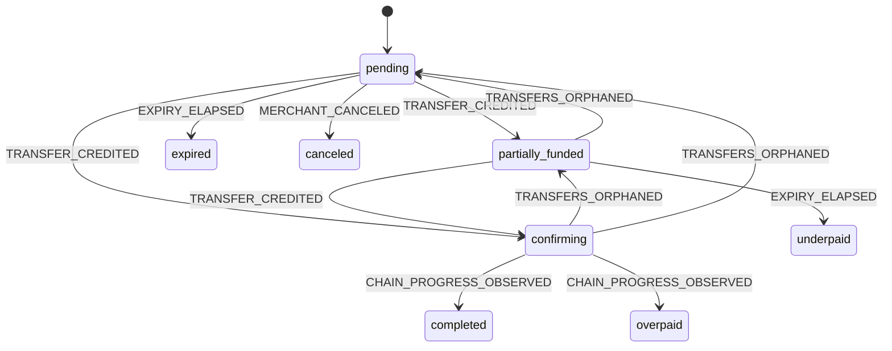

<!-- Generated by scripts/verify-docs.mjs. Do not edit by hand. -->

# Payment lifecycle

A payment holds one of 8 statuses. Exactly 11 status-changing edges are
declared, in `packages/shared/src/payment-transition-table.ts`. That table is the single source of
truth: the API's state machine and this document are both generated from it, and CI fails if they
disagree.

Of the 56 ordered pairs of distinct statuses, 11 are permitted and
45 are rejected. The test suite enumerates the full Cartesian product rather than
sampling it, and the transition table and state machine are held at 100% coverage.

## Statuses

| Status | Terminal | Can move to |
| --- | --- | --- |
| `pending` | no | partially_funded, confirming, expired, canceled |
| `partially_funded` | no | confirming, pending, underpaid |
| `confirming` | no | completed, overpaid, partially_funded, pending |
| `completed` | yes | - |
| `overpaid` | yes | - |
| `underpaid` | yes | - |
| `expired` | yes | - |
| `canceled` | yes | - |

Every terminal status is genuinely terminal: no edge leaves one. A transfer that arrives against a
finished payment is recorded and reported, never applied. Resurrection edges out of terminal states
are the bug class that double-credits a merchant.

## Triggers

- `TRANSFER_CREDITED`
- `TRANSFERS_ORPHANED`
- `CHAIN_PROGRESS_OBSERVED`
- `EXPIRY_ELAPSED`
- `MERCHANT_CANCELED`

## Transitions

| # | From | To | Trigger | Guard |
| --- | --- | --- | --- | --- |
| 1 | `pending` | `partially_funded` | `TRANSFER_CREDITED` | credited amount is above zero but below the acceptance band |
| 2 | `pending` | `confirming` | `TRANSFER_CREDITED` | credited amount reaches the acceptance band |
| 3 | `pending` | `expired` | `EXPIRY_ELAPSED` | expiry has elapsed with nothing credited |
| 4 | `pending` | `canceled` | `MERCHANT_CANCELED` | the merchant cancels while nothing is credited |
| 5 | `partially_funded` | `confirming` | `TRANSFER_CREDITED` | a further transfer brings the credited amount into the acceptance band |
| 6 | `partially_funded` | `pending` | `TRANSFERS_ORPHANED` | a reorg withdraws every credited transfer |
| 7 | `partially_funded` | `underpaid` | `EXPIRY_ELAPSED` | expiry has elapsed with value credited but below the acceptance band |
| 8 | `confirming` | `completed` | `CHAIN_PROGRESS_OBSERVED` | the finality gate opens and the credited amount is within the acceptance band |
| 9 | `confirming` | `overpaid` | `CHAIN_PROGRESS_OBSERVED` | the finality gate opens and the credited amount exceeds the acceptance band |
| 10 | `confirming` | `partially_funded` | `TRANSFERS_ORPHANED` | a reorg drops the credited amount below the acceptance band but above zero |
| 11 | `confirming` | `pending` | `TRANSFERS_ORPHANED` | a reorg withdraws every credited transfer |

## Diagram

## Decisions worth knowing

- **`confirming` cannot expire.** Once sufficient value is on chain, a timer firing is irrelevant.
  Expiring a funded payment because a clock advanced would be taking the customer's money.
- **`partially_funded` is separate from `underpaid`.** Keeping them apart is what removes any need
  for an `underpaid -> completed` edge: a top-up before expiry moves between non-terminal states,
  and after expiry the payment is finished.
- **There is no `failed` status.** A reverted ERC-20 transfer emits no Transfer event, so it is
  never observed and there is nothing to fail. Settlement failure lives in an orthogonal column that
  cannot corrupt a completed payment.
- **Multiple transfers are summed.** Aggregating credited transfers removes the need for an
  unresolved "multiple payments" status.
